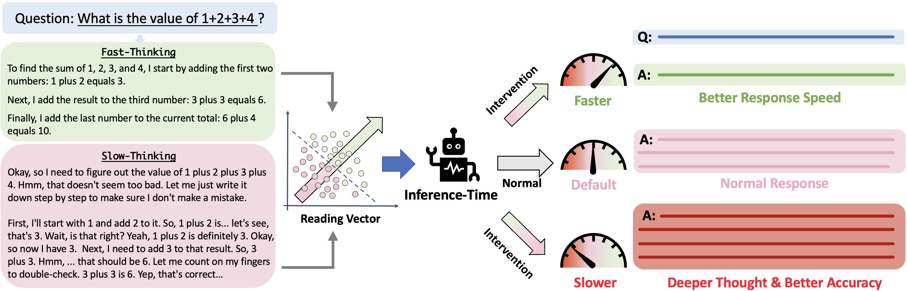
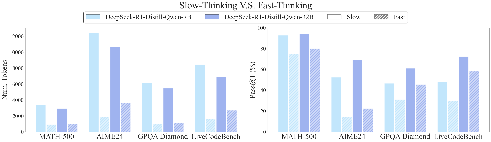
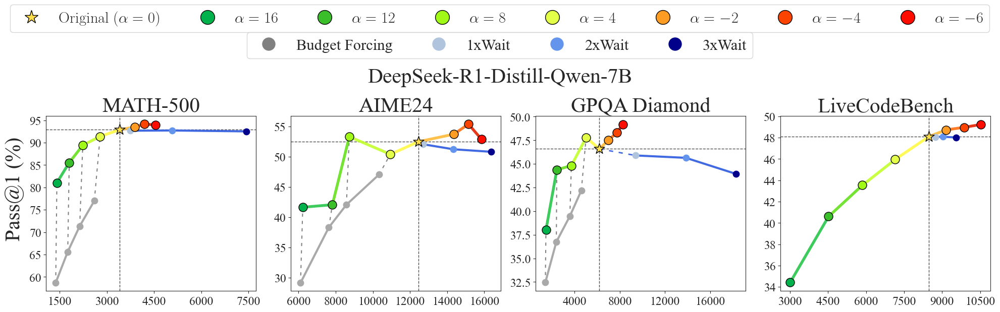
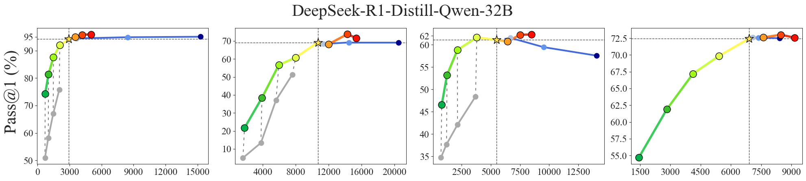
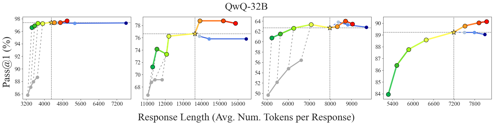

# Controlling Thinking Speed in Reasoning Models

This is the official implementation of the paper: [Controlling Thinking Speed in Reasoning Models](https://arxiv.org/abs/2507.03704) (**NeurIPS 2025 Spotlight** 💡).

<p align="center">

</p>

## 0. What is Thinking Speed Control

This work introduces a plug-and-play module that enables Large Reasoning Models (LRMs) to flexibly switch between <font color="green">System 1 thinking (fast, intuitive)</font> and <font color="red">System 2 thinking (slow, deliberate)</font>. Without modifying the underlying model parameters, this approach enhances LRMs in terms of **both accuracy and efficiency**.

## 1. Introduction

Currently, this repository provides the code for two main experiments:

* **Experiment 1: Intrinsic Fast- and Slow-Thinking in LRMs**: 
    
    We first discover that, even without targeted ability optimization during post-training (*e.g.*, the non-thinking mode in [Qwen3](https://github.com/QwenLM/Qwen3) or reasoning levels in [gpt-oss](https://github.com/openai/gpt-oss)), some LRMs **naturally exhibit both fast- and slow-thinking capabilities**.
    
    * To elicit the fast-thinking mode, we prompt LRMs to begin their reasoning with trigger words such as `To` or `First`. For example, for the [Deepseek-R1](https://github.com/deepseek-ai/DeepSeek-R1) series, we use the following template:
        ```
        <|User|>{question}<|Assistant|><think>\nTo
        ```
    * A performance comparison between the LRMs' default slow-thinking reasoning and their fast-thinking responses is shown below:
        <p align="center">
        
        </p>

* **Experiment 2: Steering Vectors for Thinking Speed Control**
    
    Building on [representation engineering], we extract **steering vectors that control thinking speed**, derived from LRMs’ representations on the sampled fast- and slow-thinking responses.

    * The scaling effect on the performance of various LRMs under different steering intensities is illustrated as follows:
        <p align="center">
        
        
        
        </p>

## 2. Installation

Please first clone this repository, then install the dependencies. We use `python=3.10`:
```bash
cd /path/to/this/repository
pip install -r requirements.txt
```

## 3. How to Run

* **Experiment 1**: To elicit a fast-thinking response from your LRM, run the following command:
    ```bash
    python run_inference.py \
        --enable_fast_thinking \
        --model_name_or_path $model_name_or_path \
        --dataset $dataset \
        --result_save_path $result_save_path \
        --max_output_tokens $max_output_tokens \
        --max_model_len $max_model_len \
        --n $n \
        --temperature $temperature \
        --gpu_memory_utilization $gpu_memory_utilization \
        --num_gpus $num_gpus
    ```

    Argument explanations:
    * `--enable_fast_thinking`: Activates the fast-thinking template for sampling responses.
    * `--model_name_or_path`: Path to the LRM.
    * `--dataset`: Choose from `aime24`, `math500`, `gpqa_diamond`, `livecodebench`.
    * `--result_save_path`: Directory to save the LRM responses.
    * `--max_output_tokens`, `--max_model_len`, `--n`, `--temperature`, `--gpu_memory_utilization`: Same as in [vllm](https://github.com/vllm-project/vllm).
    * `--num_gpus`: Number of GPUs available on your device.

* **Experiment 2**: To apply the steering vector for controlling your LRM’s thinking speed, run the following command:
    ```bash
    python run_inference.py \
        --model_name_or_path $model_name_or_path \
        --dataset $dataset \
        --result_save_path $result_save_path \
        --max_output_tokens $max_output_tokens \
        --max_model_len $max_model_len \
        --n $n \
        --temperature $temperature \
        --gpu_memory_utilization $gpu_memory_utilization \
        --num_gpus $num_gpus \
        --interventor_ckpt $interventor_ckpt \
        --intervention_coeff $intervention_coeff \
        --intervention_start_layer $intervention_start_layer \
        --intervention_end_layer $intervention_end_layer \
    ```

    Additional argument explanations:
    * `--interventor_ckpt`: The checkpoint of the thinking speed control module for your LRM. Currently supported models: `DeepSeek-R1-Distill-Qwen-7B` and `DeepSeek-R1-Distill-Qwen-32B`. More models will be added in future updates.
    * `--intervention_coeff`: Controls the steering intensity. For details, refer to [our paper](https://arxiv.org/abs/2507.03704). In brief:
        * `coeff = 0`: Default LRM responses.
        * `coeff > 0`: Faster, more direct responses.
        * `coeff < 0`: Slower, more deliberate responses.
    * `--intervention_start_layer`, `--intervention_end_layer`: Specifies the layers where the steering occurs. For `DeepSeek-R1-Distill-Qwen-7B`, set to `18` and `26`; for `DeepSeek-R1-Distill-Qwen-32B`, set to `43` and `62`. More configurations can be found in [our paper](https://arxiv.org/abs/2507.03704).


## Citation
If you find this repo or paper useful in your research, please kindly star this repo and cite this paper:

```
@article{lin2025controlling,
  title={Controlling thinking speed in reasoning models},
  author={Lin, Zhengkai and Fu, Zhihang and Chen, Ze and Chen, Chao and Xie, Liang and Wang, Wenxiao and Cai, Deng and Wang, Zheng and Ye, Jieping},
  journal={arXiv preprint arXiv:2507.03704},
  year={2025}
}
```